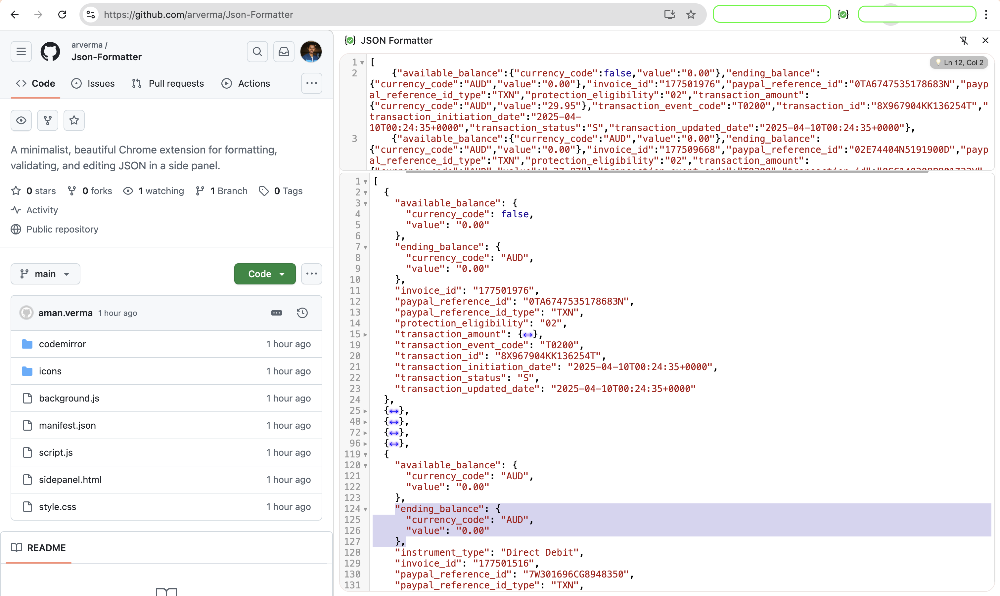
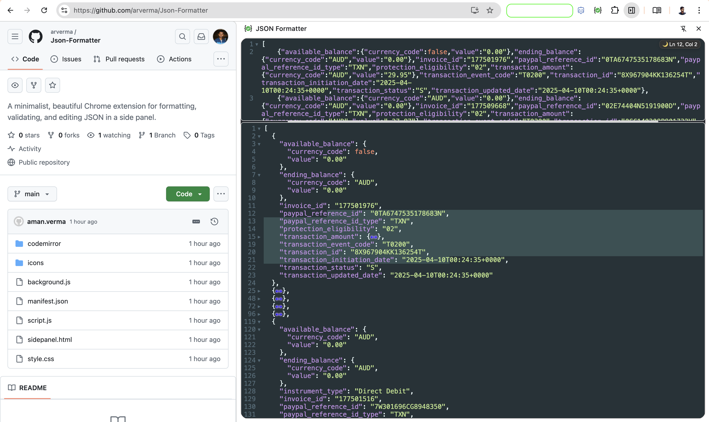

# JSON Formatter Pro

A minimalist, beautiful Chrome extension for formatting, validating, and editing JSON in a side panel.

## Screenshots

Light mode:

Dark mode:

## Features
- Two CodeMirror editors (input/output) with line numbers and syntax highlighting
- Draggable splitter for resizing
- Light/dark mode toggle
- Always-visible gutters
- Robust Chrome extension side panel logic
- Clean, modern UI/UX

## Install

1. Clone this repo
2. Go to `chrome://extensions` and enable Developer Mode
3. Click "Load unpacked" and select this folder

## Contributing

Pull requests and issues are welcome!
See [CONTRIBUTING.md](CONTRIBUTING.md) for guidelines (or just open an issue/PR if you have an idea).

## License

MIT 